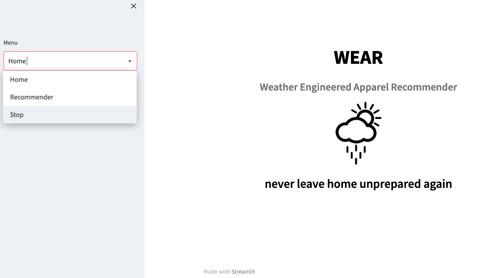
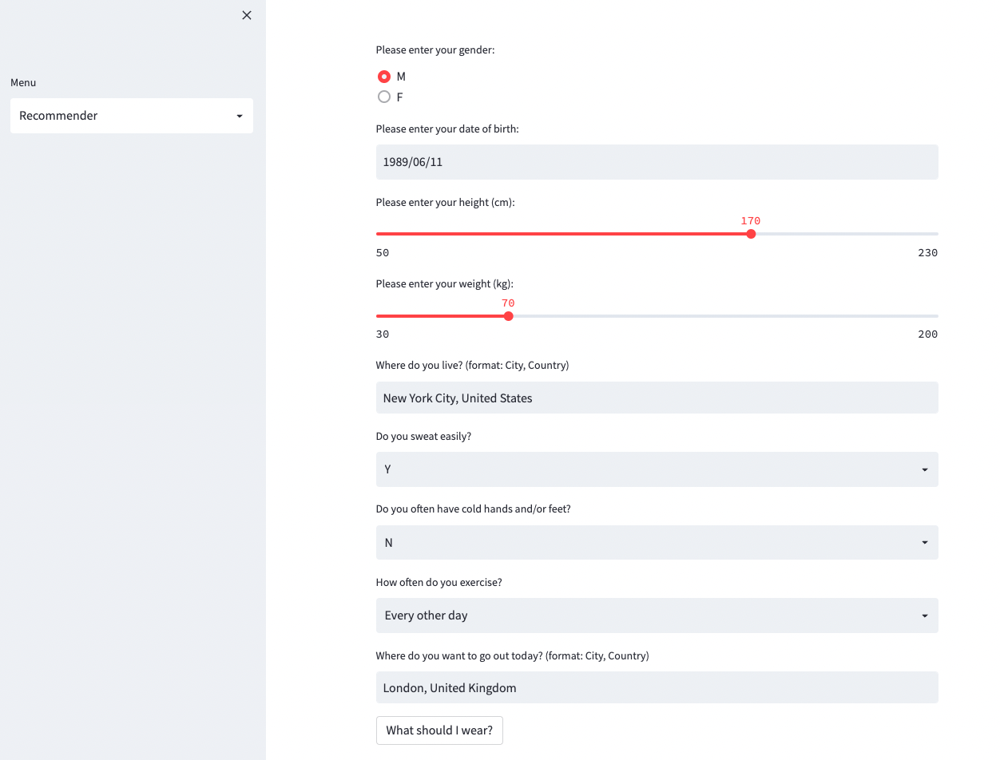
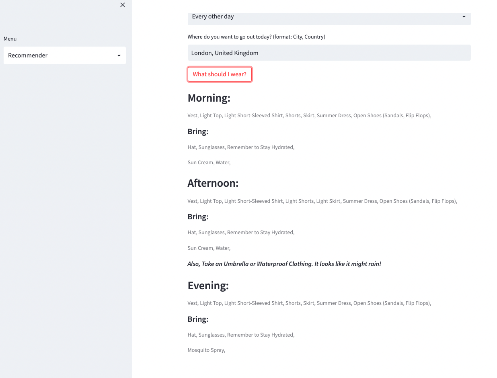

# WEAR Clothes Recommender

## Introduction

The "WEAR Clothes Recommender" is an innovative solution designed to help you make clothing choices that match the weather and your personal preferences. It's the answer to the age-old question, "What should I wear today?"

## Motivation

We've all been there—staring out the window, uncertain about what to wear for the day or whether to bring that jacket for a night out. These everyday fashion dilemmas inspired the creation of WEAR, the Weather Engineered Apparel Recommender.

## Features

- **Weather-Based Recommendations:** WEAR analyzes current weather conditions to provide you with outfit suggestions suitable for the temperature, precipitation, and time of day.

- **Personalized User Experience:** Tailor your clothing recommendations to your unique style and comfort.

## Code Style

This project utilizes the following technologies and tools:

- **Python:** The core programming language used for development.
- **APIs:** Integration with Breezometer's Weather API to fetch real-time weather information.
- **Streamlit:** The user interface is built with Streamlit, providing a user-friendly experience.

## Testing and Validation

The notebooks included in this repository cover various phases of data testing. To ensure the accuracy of our recommendations, we simulated data and tested it against a linear regression model, achieving a high correlation coefficient of 0.99.

## How To Use

1. **API Setup:** Obtain an API key from Breezometer for their Weather API v1.
2. **Configuration:** Insert your API key into the file `Part_2-User_Creation_and_Weather_Prediction.ipynb` in two specific locations as mentioned in the notebook.

## Screenshots

- **WEAR Home:** 

This image showcases the key criteria for the program, emphasizing the importance of location and destination temperature differences.

- **WEAR Recommendation Form:**

In this screenshot, you can see the output, which provides clothing recommendations and essential items for morning, afternoon, and evening. The recommendations dynamically adjust based on the current time of day and precipitation probability.

## Presentation

For further insights into this project, please refer to the presentation: [WEAR Clothes Recommender Presentation](https://docs.google.com/presentation/d/1VsOmPfjYNieaAgi7Opnb7KuJZAOU-Rn6O3HHH2YXI9o/edit#slide=id.g142a476bfa7_0_452).

## Credits

Data sources that contributed to the project:

- **API:** Breezometer Weather Information - [Breezometer Weather API](https://www.breezometer.com/products/weather-api).
- **Geographical Information:** Latitude and Longitude data sourced from [Geonames - Cities with a Population > 1000](https://public.opendatasoft.com/explore/dataset/geonames-all-cities-with-a-population-1000/information/?disjunctive.cou_name_en&sort=name).

Thank you for exploring the WEAR Clothes Recommender. We hope it simplifies your daily clothing decisions and enhances your fashion experience!
